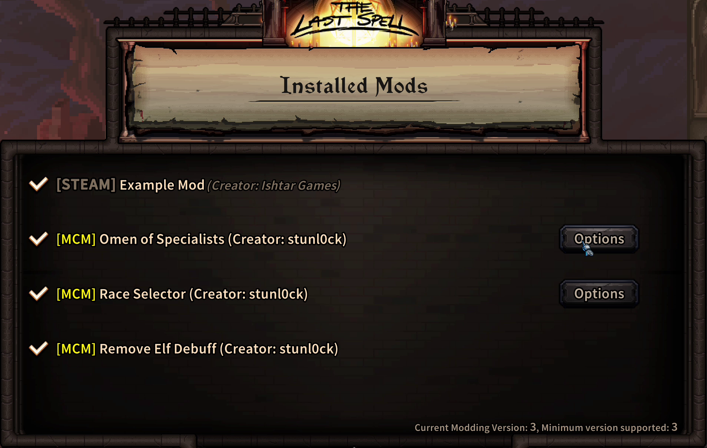

### The Last Spell ModKit
 (TLS.ModKit)

[](https://www.nexusmods.com/thelastspell/mods/29)<br>
[-blue)](https://github.com/BepInEx/BepInEx/releases/tag/v5.4.23.3)

**Download:** [Nexus](https://www.nexusmods.com/thelastspell/mods/29) · **BepInEx 5 (x64):** [Release](https://github.com/BepInEx/BepInEx/releases/tag/v5.4.23.3)


## Summary

**TLS.ModKit** lets you easily create *data-only* mods using XML files that the game picks up automatically from your `BepInEx/plugins/<YourMod>/ModKit/` folder. 

> No programming required. For specific cases where mods may break/impact in game functionality you may need to create a custom BepInEx mod to make it compatible (see **Omen of Specialists** example below).

**Current support:**

- **GlyphDefinition** (Omens)
  - **add / replace / remove** glyphs (omens)
- **PerkDefinition**
  - **add / replace / remove** perks
  - **edit** perk **TokenVariables** (token-only edits)
- **SkillDefinition**
  - **add / replace / remove** skills
  - **edit** simple fields via `<Set select="..." value="..."/>` (best-effort)
- **ItemDefinition**
  - **add / replace / remove** items
  - `edit` not implemented (use `replace`)
- **CityStash** (runtime, NewGame only)
  - **add** items to the city stash via `ModKit/CityStash/*.patch.xml`
- **Localization**
  - auto-merge `ModKit/languages.csv` from all plugin folders after the game loads dictionaries
- **Icons**
  - drop PNGs under `ModKit/Icons/*.png` to override **glyph** and **item** sprites (UI + hand sprites)

## Installation

### 1) Install BepInEx 5 (x64)
- Download **[BepInEx_win_x64_5.4.23.3.zip](https://github.com/BepInEx/BepInEx/releases/tag/v5.4.23.3)**
- Extract it **into your game folder** e.g. → `C:\Program Files (x86)\Steam\steamapps\common\The Last Spell\`
> Tip: run the game once so BepInEx creates its subfolders.

### 2) Install TLS.ModKit
- Download **[TLS.ModKit](https://www.nexusmods.com/thelastspell/mods/30?tab=files)**
- Extract into:
`...\The Last Spell\BepInEx\plugins\`
- Result: `...\The Last Spell\BepInEx\plugins\TLS.ModKit`

## Recommended: Mod Configuration Manager (MCM)



**Install (optional but recommended)**
- Download **MCM**: [Nexus](<https://www.nexusmods.com/thelastspell/mods/31>) · [GitHub](<https://github.com/stunl0ck/tls-mcm>)
- Drop the folder into: `...\The Last Spell\BepInEx\plugins\`
- Launch the game; MCM shows your mods under Mods window in game

> MCM isn’t required for ModKit, but it makes verifying loaded mods easier


## Example Mods

- **Omen of Specialists** — adds a new Omen that grants the *`Specialist`* perk to all heroes.  
  [Nexus](<https://www.nexusmods.com/thelastspell/mods/32>) · [GitHub](<https://github.com/stunl0ck/tls-omen-of-specialists>)

- **Lightning Blade** — a “full stack” example: custom item + skills + icons, optional MCM setting, and (runtime) adds the item to city stash on new runs.  
  [GitHub](<https://github.com/stunl0ck/tls-lightning-blade>)

- **Remove Elf Debuff** — edits the `IntoTheWild` perk to remove the damage debuff (`StatMalus = 0`).  
  [Nexus](<https://www.nexusmods.com/thelastspell/mods/29>) · [GitHub](<https://github.com/stunl0ck/tls-remove-elf-debuff>)

- **Remove Into the Wilds** — removes the `IntoTheWild` perk.  
  [Nexus](<https://www.nexusmods.com/thelastspell/mods/29?tab=files>) · [GitHub](<https://github.com/stunl0ck/tls-remove-into-the-wilds>)

> Each example shows how patches are organized under `BepInEx/plugins/<YourMod>/ModKit/` (e.g., `Perks/…`, `Glyphs/…`) and how to ship optional icons via `ModKit/Icons/`.


## Quick Start

The fastest way to learn is to copy an existing mod and tweak it.

- Read the **[quickstart guide](docs/quickstart.md)**
- Browse the example mods above and reuse their folder structure:
  - `ModKit/Perks/*.patch.xml` — add/remove/edit perk **tokens**
  - `ModKit/Glyphs/*.patch.xml` — add/replace glyphs, optional `<IconOverride Path="…"/>`
  - `ModKit/Skills/*.patch.xml` — add/remove/replace/edit skills
  - `ModKit/Items/*.patch.xml` — add/remove/replace items
  - `ModKit/Icons/*.png` — optional custom omen icons (auto-loaded)

**Tips & Tools**
- [**UABEA**](<https://github.com/nesrak1/UABEA>) — extract Unity `TextAsset` contents to inspect the game’s XML (essential for finding the exact IDs/keys to patch).  
- [**dnSpy**](<https://github.com/dnSpy/dnSpy>) / [**ILSpy**](<https://github.com/icsharpcode/ILSpy>) — inspect `TheLastStand.dll` to see how databases load and which definitions/fields exist (useful if you plan a small BepInEx helper for advanced cases).
- **Logging Console**: Enable the console; Edit BepInEx config in `...\The Last Spell\BepInEx\config\BepInEx.cfg`

```
[Logging.Console]
Enabled = true
```


## Uninstall

Simply delete the `TLS.ModKit` folder and any other `Mods` depending on it inside of `.../BepInEx/plugins/`

## License

MIT
